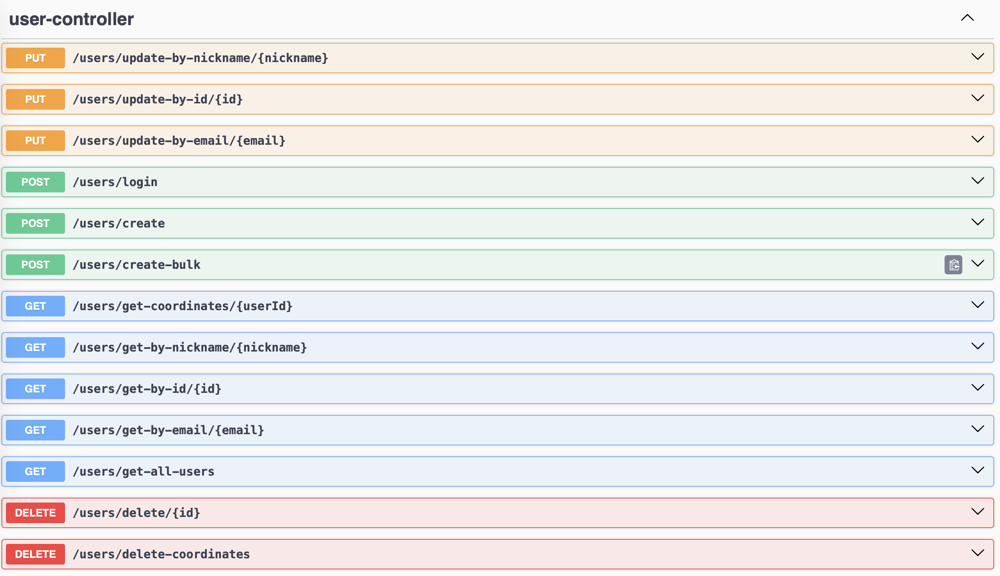
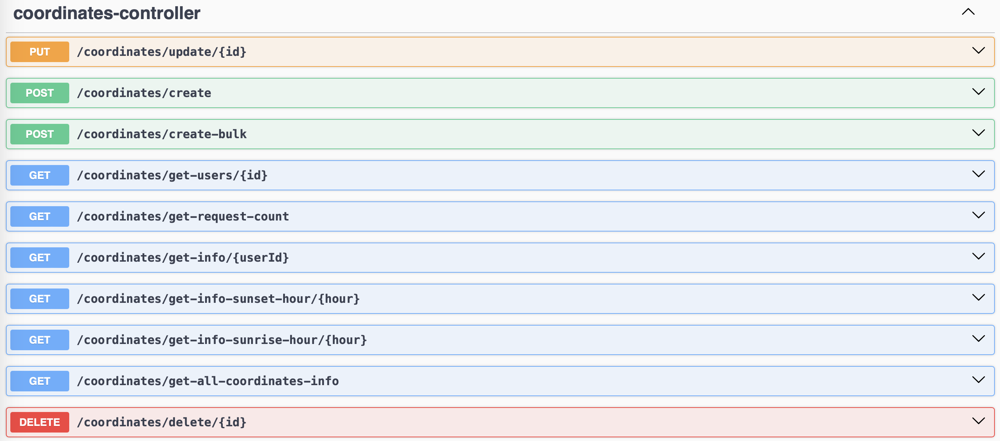
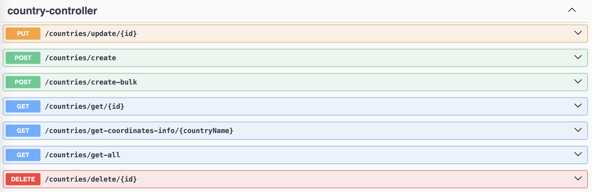
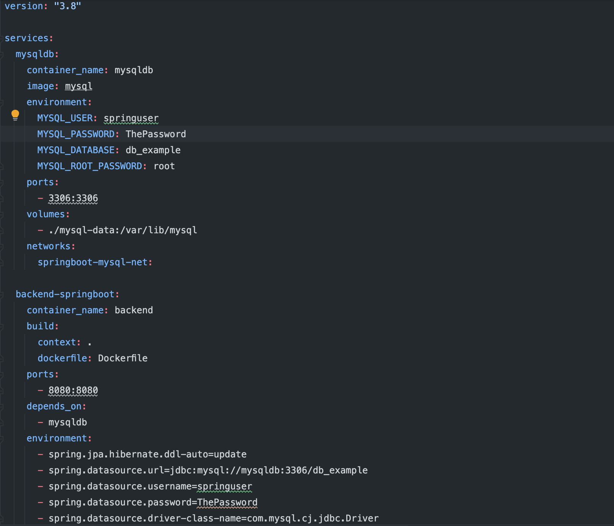
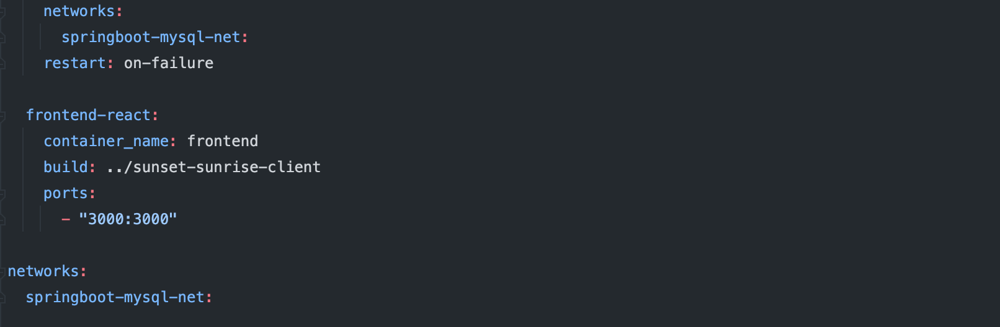

# Sunset and Sunrise application

This repository contains a simple REST API application that provides ability to get sunset and sunrise time by latitude, longitude and date.

## Table of Contents

- [Introduction](#introduction)
- [Technologies Used](#technologies-used)
- [Getting Started](#getting-started)
  - [Prerequisites](#prerequisites)
  - [Installation](#installation)
- [Swagger-Documentation](#swagger-documentation)
- [Docker](#docker)
- [Contributing](#contributing)

## Introduction

This is a basic REST API application built using [Spring Boot](https://spring.io/projects/spring-boot) framework and [Maven](https://maven.apache.org). The application allows users to get information about sunset and sunrise time information for a coordinates by making HTTP requests to predefined endpoints.

## Technologies Used

- [Spring Boot](https://spring.io/projects/spring-boot): Web framework for building the REST API.
- [Spring Data JPA](https://spring.io/projects/spring-data-jpa): Data access framework for interacting with the database.
- [MySQL](https://www.mysql.com): Database for local and global use.
- [Sunrise Sunset API](https://api.sunrise-sunset.org/json): External API for sunrise and sunset time information.

## Getting Started

### Prerequisites

Make sure you have the following installed:

- Java (version 17 or higher)
- Maven
- MySQL server
- MySQL driver
- JPA

### Installation

1. Clone the repository:

    ```bash
    git clone https://github.com/Willygodx/SunsetSunriseService
    ```

2. Build the project:

    ```bash
    mvn clean install
    ```

3. Run the application:

    ```bash
    java -jar target/SunsetSunriseService-0.0.1-SNAPSHOT.jar
    ```

The application will start on `http://localhost:8080`.

## Swagger-Documentation

```bash
  http://localhost:8080/swagger-ui.html
  ```
Swagger allows development team to visualize and interact with the API's resources without having any of the implementation logic in place.





Instead of 8080 you have to write port where application is started.

## Docker


1. Clone repositories:
    ```bash
    git clone https://github.com/Willygodx/SunsetSunriseService.git
    git clone https://github.com/Willygodx/sunset-sunrise-client.git
    ```
   
2. Modify the docker-compose.yml file (build:):




3. Build and run the application:

- Open a terminal in the SunsetSunriseService directory.
- Run the following command:
  ```bash
  docker-compose up
    ```
  This will build and run the containers with database, backend application and frontend application.

## Contributing

Contributions are welcome! If you find any issues or have improvements to suggest, feel free to open an issue or create a pull request.

